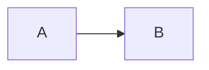

## 测试一下代码块

```python
for i in range(10):
    print('hello')
```

## 测试一下勾选框

- [ ] 待完成
- [x] 已经完成

## 测试内容引用

> hahaha

## 测试文字格式

~this~ $is$ a demo

## 测试公式输入

$$E = mc^2$$

## 测试列表

- 香蕉
- 苹果
- 菠萝

1. 鸡蛋
2. 白菜
3. 猪肉

## 测试连接

This is [github](www.github.com)

## 测试转义字符

\* Without the backslash, this would be a bullet in an unordered list.

## 测试中心对齐

<p align="center">行中心对齐</p>
<p align="left">行左对齐</p>
<p align="right">行右对齐</p>

## 测试流程图



## 测试文本折叠

<details>
  <summary>折叠代码块</summary>
  <pre><code> 
     System.out.println("虽然可以折叠代码块");
     System.out.println("但是代码无法高亮");
  </code></pre>
</details>