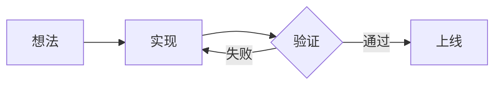
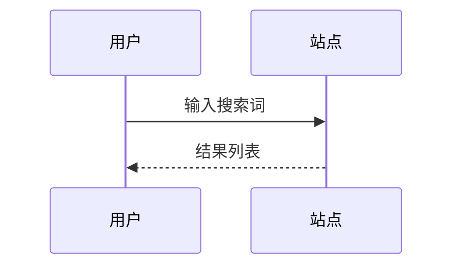

+++
title = "Mermaid"
+++

## 流程图

```mermaid
graph LR
  A[想法] --> B[实现]
  B --> C{验证}
  C -->|通过| D[上线]
  C -->|失败| B
```

## 时序图

```mermaid
sequenceDiagram
  participant U as 用户
  participant S as 站点
  U->>S: 输入搜索词
  S-->>U: 结果列表
```
